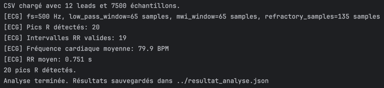
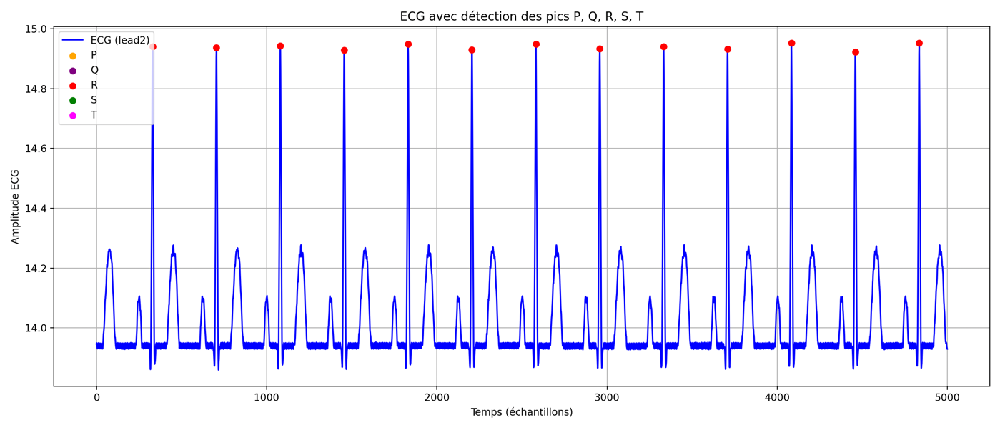
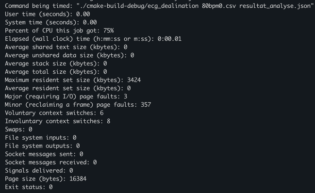

## Objectif
Implémenter un algorithme de détection de pics R dans un signal ECG en C, en utilisant la méthode de Pan-Tompkins.
J'ai également essayé de privilégier la performance, que ça soit l'utilisation de la mémoire ou la latence.

## Méthode
En s'inspirant de l'algorithme de Pan-Tompkins, j'ai implémenté les étapes suivantes :

1. Filtre passe-haut avec `ecg_highpass_ma()`.
2. Dérivée du signal avec `ecg_derivative_1()`.
3. Mise au carré du signal avec `ecg_square()`.
4. Intégration fenêtre glissante avec `ecg_mwi()`.
5. Détection seuil adaptif + période réfractaire.

## Choix d'implémentation
- **Pas d'alloc dynamique** : Les buffers sont alloués une seule fois dans `ecg_Create()`. Pas de malloc utilisés pendant l'analyse.
- **Somme gissante en O(n)** : Le filtre passe-haut et l'intégration utilisent des sommes gissantes pour éviter les recalculs redondants.
- **Seuil adaptatif en O(1)** : Le seuil de détection est ajusté dynamiquement à chaque pic san historique. Aucun tableau et recalcul nécessaire.
- **Accès séquentiel** : Passe linéaire sur tableau contigu.

## Résultats
En lancant le programme avec `../80bpm0.csv ../resultat_analyse.json` comme paramètre pour spécifier le fichier d'entrée
et de sortie, j'obtiens ce résultat dans le terminal :

{width=400px}

Le fichier `resultat_analyse.json` se trouve à la source du projet.

Et voici le résultat du scripte python pour afficher le plots avec les deux fichiers :

{width=400px}

## Benchmark

### Hyperfine
En utilisant `hyperfine` pour mesurer les performances de l'implémentation avec cette commande :

`hyperfine './cmake-build-debug/ecg_dealination 80bpm0.csv resultat_analyse.json' --warmup 100 -N --export-json=resultat_hyperfine.json`

J'ai obtenu les résultats suivants :

{width=400px}

### gtime
J'ai également utilisé `gtime` qui est un équivalent de `usr/bin/time` pour mac, afin de mesurer le temps d'exécution
de l'implémentation avec cette commande :

`gtime -v ./cmake-build-debug/ecg_dealination 80bpm0.csv resultat_analyse.json`

Rien de très concluant, car temps d'exécution est très rapide, mais voici les résultats :

{width=400px}

## Conclusion
L'implémentation de l'algorithme de Pan-Tompkins en C a permis de détecter efficacement les pics R dans le signal ECG.
En optimisant l'utilisation de la mémoire et en évitant les recalculs redondants, j'ai réussi à obtenir une solution
performante. Les résultats obtenus sont cohérents avec les attentes, et les benchmarks montrent que l'implémentation
est rapide.